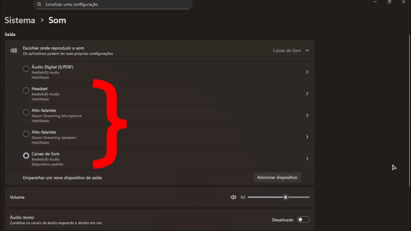
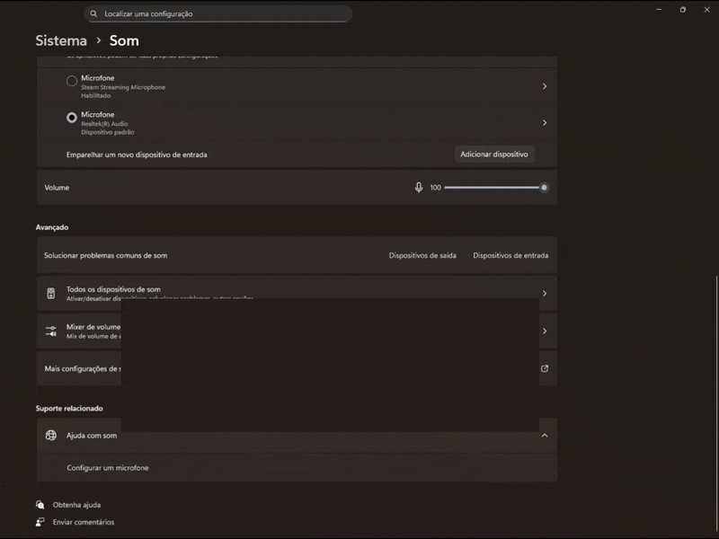

# autohotkey-scripts
Repositório de alguns scripts AutoHotkey pessoais meus para automatização de comandos do Windows.

# TrocaAudio.ahk
O "TrocaAudio" é um script que ao clicar no botão de contexto do teclado (fica entre Botão do Windows direito e Ctrl direito, próximos ao AltGr), troca da Caixa de Som para o Headset, está personalizado para minha máquina mas pode ser modificado para seu uso conforme o nome de seus drivers de som. Fiz isso pois troco constantemente entre o Headset e Caixas de Som.

# Volume.ahk
O "Volume" é um script que ao segurar Shift Direito, pode-se alterar o volume do PC via setas Cima e Baixo, intuitivamente, RShift + Cima aumenta o volume, e RShift + Baixo diminui o volume. Fiz isso pois meu teclado não tem uma teclas de multimídia.

